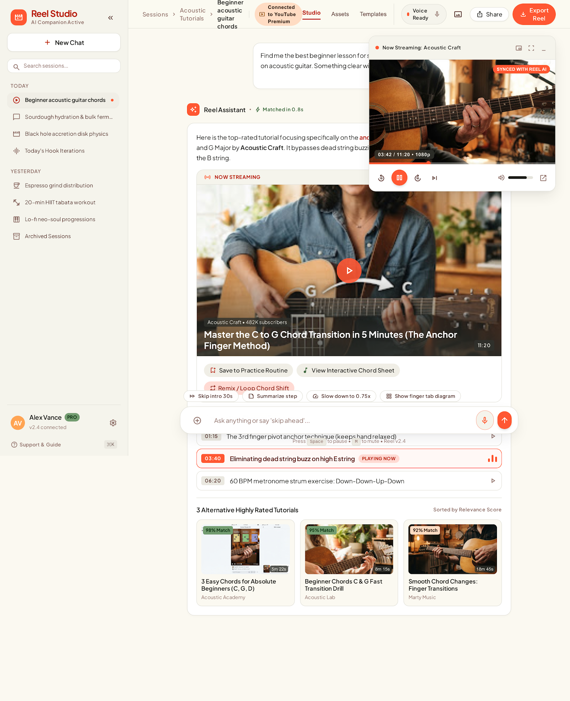
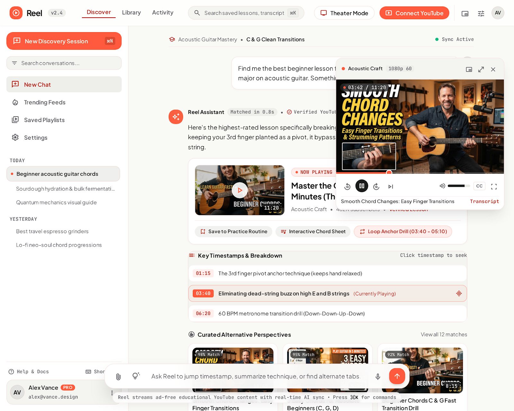

# OTT-AI — design reference

Target design for the OTT-AI chat + player UI (the product was called "Reel" in the
Stitch screens; renamed in OTTAI-15), taken from the Stitch project
**"Reel – AI video chat redesign"** (`7451425264893948025`). Two screens define it:

| | Screen | Stitch ID | Image |
|---|---|---|---|
| A | Reel — Chat-first with Mini-player ("Reel Studio" variant) | `2a6a52306bb944578057dc6fe0dd47c5` | [docs/design/chat-mini-player-a.png](docs/design/chat-mini-player-a.png) |
| B | Reel — Chat-first with Mini-player (guitar-lesson variant) | `6e76d0aa308442a5ad03cf4701519b3d` | [docs/design/chat-mini-player-b.png](docs/design/chat-mini-player-b.png) |




Both are the same concept: **chat is the main surface, and the playing video docks as a
floating mini-player** in the top-right corner, so you can keep reading and typing
while it plays. Where the two disagree, this doc says which one wins.

---

## 1. Theme

Light, warm theme: coral accent on an off-white "paper" background. It **replaces** the
current zinc theme, and also the dark violet theme that was tried on
`fix/center-column-alignment` (uncommitted).

### Colors (Material 3 style tokens from the Stitch export; B values, A in brackets where different)

| Token | Value | Use |
|---|---|---|
| `background` / `surface` | `#F9F9F6` (A `#FBF9F1`) | Page background |
| `surface-container-lowest` | `#FFFFFF` | Cards, composer, mini-player |
| `surface-container-low` | `#F4F4F1` (A `#F5F4EC`) | Left sidebar, message cards |
| `surface-container` | `#EEEEEB` (A `#F0EEE6`) | Chips, timestamp rows |
| `surface-container-high` | `#E8E8E5` (A `#EAE8E0`) | Hover, selected history item |
| `surface-container-highest` | `#E2E3E0` (A `#E4E3DB`) | Dividers, progress track |
| `on-surface` | `#1A1C1B` | Main text |
| `on-surface-variant` | `#5B403B` | Secondary text (warm brown-grey) |
| `outline` | `#8F706A` | Muted text, icons |
| `outline-variant` | `#E3BEB7` | Hairline borders |
| `primary-container` | `#FF5A3D` (A `#FF5733`) | **Brand coral**: primary buttons, send, play, active dot, progress fill |
| `primary` | `#B5250E` (A `#B72301`) | Coral text on light (links, active tab, timestamps) |
| `on-primary` | `#FFFFFF` | Text on coral buttons |
| `primary-fixed` | `#FFDAD3` | Soft coral fill: "Now playing" pill, current-timestamp row |
| `primary-fixed-dim` | `#FFB4A5` | Coral border on the current row / loop chip |
| `secondary` | `#5E5E63` | Neutral secondary |
| `error` | `#BA1A1A` | Errors |
| success (A only) | `#406840` / `#C1EEBC` | "Matched in 0.8s", "98% Match" badges |

### Typography

- **Plus Jakarta Sans** for everything (400/500/600/700).
- **JetBrains Mono** (B) for timecodes, quality labels (`1080p 60`), keyboard hints (`⌘K`) and the footer hint.
- Scale (B): headline-md 24/32 w600 −0.015em · headline-sm 20/28 w600 · body-lg 18/28 · body-md 15/24 · label-sm 12/16 w600 +0.02em.

### Shape and elevation

- Cards and mini-player: 16–20px radius, white, 1px `outline-variant` border, large soft shadow.
- Buttons, chips, composer: pill (full radius). Primary = coral fill + white text.
- Timestamp rows: 12px radius; the current one gets a `primary-fixed` fill and a `primary-fixed-dim` border.

---

## 2. Layout

```
┌ Left sidebar ─┬──────── Top bar (tabs · search ⌘K · Theater Mode · Connect YouTube · avatar) ────────┐
│ New session   │  Breadcrumb: Topic • Session title                 Sync Active ●  ┌ Mini-player ┐   │
│ Search        │                                                                    │  (~420px)   │   │
│ Nav links     │       ┌ centered chat column (~760px) ┐                             └─────────────┘   │
│ Today / Yest. │       │ user bubble                    │                                              │
│ history       │       │ assistant message + video card │                                              │
│               │       │ key timestamps                 │                                              │
│ Profile       │       │ alternatives                   │                                              │
│ Help/Shortcut │       └────────────────────────────────┘                                              │
│               │               quick-action chips · pill composer · hint line                          │
└───────────────┴───────────────────────────────────────────────────────────────────────────────────────┘
```

- **No right panel.** "Up next" moves into the chat as the "alternatives" block. History moves into the left sidebar, grouped Today / Yesterday.
- Chat column about 760px, centered. The composer floats at the bottom as a pill.

---

## 3. Features shown

### 3.1 Mini-player (floating, top-right, ~420px)
- Header: red live dot, "Now Streaming: {channel}" (A) or channel + quality pill `1080p 60` (B), then buttons for mini/theater, expand/fullscreen, minimize/close.
- Video with an overlaid time badge `03:42 / 11:20 • 1080p`, and a "Synced with Reel AI" badge (A).
- Coral progress bar with a scrub handle.
- Controls: back / forward (built-in seek), **round coral play/pause**, next, volume slider, CC (B), fullscreen / pop-out.
- Footer (B): video title + "Transcript" link.
- The video keeps playing while you scroll and type in the chat.

### 3.2 Assistant message with a rich video card
- Header: Reel Assistant avatar (coral sparkle), "Matched in 0.8s" badge, "Verified YouTube Source".
- Reply text with **coral highlighted key phrases**.
- Video card: thumbnail with duration, "NOW PLAYING VIA MINI-PLAYER • 03:42 / 11:20" (B) / "Now Streaming · Resuming at 03:42" (A), title, channel • subscribers • "Verified Lesson".
- Card actions (chips): Save to Practice Routine, Interactive Chord Sheet, **Loop section (03:40 – 05:10)**.

### 3.3 Key timestamps / chapter takeaways
- Title "Key Timestamps & Breakdown" with the hint "Click timestamp to seek".
- Rows: mono timestamp pill + one-line takeaway; clicking seeks the player.
- The **current chapter** is highlighted (coral fill, "PLAYING NOW" / "(Currently Playing)", equalizer icon).

### 3.4 Alternatives ("Curated Alternative Perspectives")
- Three cards: thumbnail, **"98% Match"** relevance badge, duration, title, channel.
- "View all 12 matches" / "Sorted by Relevance Score". This replaces the right-panel "Up next".

### 3.5 Quick-action chips (A, above the composer)
- Skip intro 30s · Summarize step · Slow down to 0.75x · Show finger tab diagram. They are context-aware suggestions for the video that's playing.

### 3.6 Composer
- Pill input: attach (+), idea/suggest icon (B), placeholder "Ask anything or say 'skip ahead'…", mic, coral round send.
- Hint line in mono: "Press Space to pause • M to mute" (A) / "Press ⌘K for commands" (B).

### 3.7 Left sidebar
- Brand + "AI Companion Active" status, coral **New Discovery Session** (⌘N) button.
- "Search conversations…" input.
- Nav: New Chat, Trending Feeds, Saved Playlists, Settings.
- History grouped **Today / Yesterday** with per-topic icons, active item marked with a coral dot; "Archived Sessions".
- Footer: profile card (avatar, name, plan badge, email), Help & Docs, Shortcuts.

### 3.8 Top bar
- Tabs Discover / Library / Activity (B) or Studio / Assets / Templates (A).
- Global search with ⌘K, Theater Mode toggle, "Connect YouTube" (coral), Voice Ready status (A), Share / Export (A), avatar.
- Breadcrumb row: topic icon · topic • session title, plus a "Sync Active" status.

---

## 4. Gap vs. the current app

| Area | Now | Target |
|---|---|---|
| Theme | zinc (committed); violet dark (uncommitted experiment) | Coral light (§1) |
| Fonts | Flutter default | Plus Jakarta Sans + JetBrains Mono, bundled |
| Player | Full overlay over chat; mini-player prototype (uncommitted, 360px) | Mini-player per §3.1 as the main mode; full/theater as an option |
| Up next | Right panel / inline strip | In-chat alternatives with match % (§3.4) |
| History | Right panel tab / sheet | Left sidebar, Today / Yesterday, search |
| Chapters | none | Key timestamps, click to seek, current highlighted (needs backend data) |
| Quick actions | none | Context chips above the composer |
| Composer | rounded box, mic, send | pill, attach, mic, coral send, hint line |
| Card actions | none | Save / Loop section / notes |
| Top bar | none (desktop) | Tabs, ⌘K search, Theater Mode, avatar |

## 5. Open decisions

- **`M` key:** the design uses `M` for **mute**. The mini-player prototype uses `M` for **minimize**. Pick one (suggestion: `M` = mute as designed, `I` = mini-player, `T` = theater).
- **Seek** is built in and not a design decision: the existing 25s step (`AppConfig.seekStep`), ←/→ keys and voice commands ("forward 25 sec") stay as they are. The design's ±10s labels are cosmetic.
- **Out of scope for now** (shown in the design but not backed by the product): Export Reel, Share, Connect YouTube Premium, Pro plan badge, Trending Feeds, Saved Playlists, Assets/Templates tabs, interactive chord sheet / finger tab diagrams (these are specific to the guitar example).

---

## 6. Implementation: shadcn_ui

The Flutter app is built on [`shadcn_ui`](https://pub.dev/packages/shadcn_ui) (0.57.1). Stitch exports Tailwind HTML; each part of the design is rebuilt with shadcn components and theme tokens, not copied as markup.

**Rule:** build UI with `shadcn_ui` components and `ShadTheme` tokens. Use plain Flutter widgets only where shadcn has no equivalent, and say so in the PR.

| Feature (ticket) | shadcn components |
|---|---|
| Theme (OTTAI-2) | `ShadColorScheme` (coral), `ShadTextTheme` with bundled fonts, `ShadThemeData` radius / shadows |
| Mini-player (OTTAI-3) | `ShadCard` shell, `ShadIconButton` / `ShadButton` controls, `ShadProgress` or `ShadSlider` (scrub), `ShadSlider` (volume), `ShadBadge` (quality), `ShadTooltip` |
| Playback mode (OTTAI-4) | `ShadButton.outline` (Theater toggle) |
| Video card (OTTAI-5) | `ShadCard`, `ShadBadge` ("Matched in 0.8s", "Now playing"), `ShadAvatar`, `ShadButton.outline` action chips |
| Key timestamps (OTTAI-6) | `ShadAccordion` (collapsible), `ShadBadge` ("Playing now") |
| Alternatives (OTTAI-7) | `ShadAccordion` (collapsible), `ShadCard`, `ShadBadge` (match %) |
| Quick-action chips (OTTAI-8) | `ShadButton.outline`, `ShadButtonSize.sm` |
| Composer (OTTAI-9) | `ShadInput`, `ShadIconButton` (attach / mic / send) |
| Left sidebar (OTTAI-10) | `ShadButton`, `ShadInput` (search), `ShadAvatar`, `ShadBadge` (Demo), `ShadSheet` (phone) |
| Top bar (OTTAI-11) | `ShadInput` (⌘K search), `ShadBreadcrumb`, `ShadButton.outline` (Theater) |
| Shortcuts (OTTAI-12) | `ShadDialog` |
| Loop section (OTTAI-13) | `ShadButton.outline`, `ShadBadge` (loop state) |
| Settings (OTTAI-14) | `ShadTabs`, `ShadSelect`, `ShadSwitch`, `ShadRadioGroup`, `ShadInput`, `ShadDialog` (confirm delete) |

**Existing plain-Flutter spots to convert (done with OTTAI-2):**
- `Material` + `InkWell` tappable rows: `VideoCard` in `app/lib/chat/widgets.dart` and history rows in `app/lib/shell/history.dart` → shadcn ghost button / card tap targets.
- Hand-drawn progress bars in `app/lib/player/player_overlay.dart` and `app/lib/player/mini_player.dart` → `ShadProgress`.
- Ad-hoc `Container` / `DecoratedBox` card and badge styling (`app/lib/chat/widgets.dart`, `app/lib/player/mini_player.dart`) → `ShadCard` / `ShadBadge`.

**Allowed exception:** loading spinners. shadcn 0.57.1 has no spinner, so `CircularProgressIndicator` stays (`main.dart`, `auth/login_screen.dart`, `auth/demo_screen.dart`, send button in `chat/widgets.dart`, `shell/history.dart`), colored from `ShadTheme` tokens.

## 7. Next: Recommended rail, per-chat saves, token usage

Requirements: [docs/requirements/recommended-rail-and-chat-saves.md](docs/requirements/recommended-rail-and-chat-saves.md).
